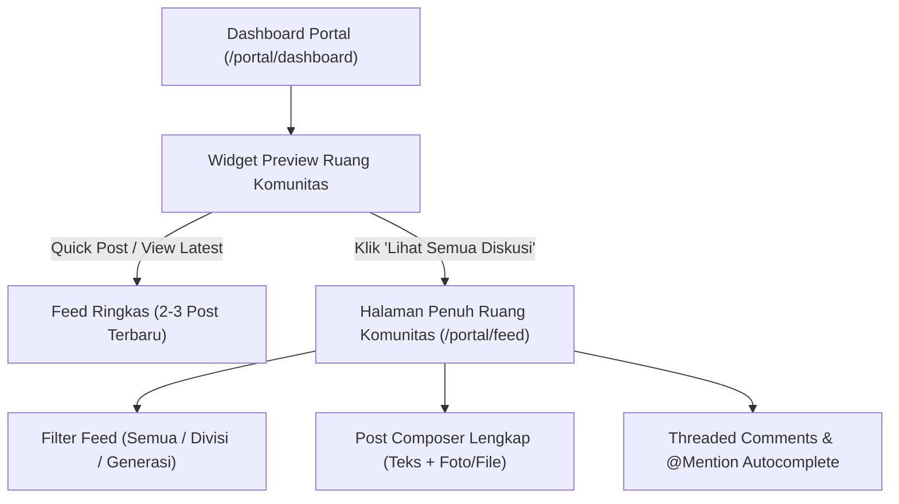

# Rencana Implementasi: Fitur Ruang Komunitas & Timeline (Social Feed, @Mention, & Komentar)

> **Status**: *Draft Proposal / Planning*  
> **Target**: Portal Anggota IAI Muda Wilayah DKI Jakarta (`/portal/dashboard` & `/portal/feed`)  
> **Model Desain**: Hybrid Model (Dashboard Quick Widget + Full Dedicated Feed Page)

---

## 1. Latar Belakang & Tujuan

Sebagai wadah organisasi pengurus dan alumni **IAI Muda Wilayah DKI Jakarta**, Portal Anggota tidak hanya berfungsi sebagai sistem manajemen informasi pasif, melainkan juga tempat berinteraksi, berjejaring (*networking*), dan berbagi wawasan profesional.

### Tujuan Utama:
1. **Meningkatkan Engagement Internal**: Memudahkan anggota membagikan kabar kegiatan divisi, milestone karir, atau diskusi topik akuntansi.
2. **Konektivitas Antar Generasi & Divisi**: Memungkinkan komunikasi lintas bidang tanpa hambatan struktur.
3. **Notifikasi Interaktif via `@Mention`**: Memudahkan memanggil atau menandai anggota tertentu dalam diskusi.

---

## 2. Arsitektur UX & Penempatan Fitur (Hybrid Model)

Sesuai persetujuan, fitur ini akan menggunakan **Opsi 2 (Hybrid Model)**:



### A. Widget Preview di Dashboard (`/portal/dashboard`)
- **Quick Post Input Box**: Kotak teks ringkas *"Apa yang sedang Anda kerjakan/diskusikan hari ini?"*.
- **Post Ticker**: Menampilkan 2–3 postingan terbaru yang paling aktif didiskusikan.
- **Direct Action**: Tombol *Komentari*, *Like*, dan CTA *"Buka Ruang Komunitas Penuh →"*.

### B. Halaman Penuh Ruang Komunitas (`/portal/feed`)
- **Header & Navigation**: Terintegrasi di Sidebar Portal di bawah menu *Pengumuman*.
- **Filter Feed Tab**:
  - 🌐 **Semua Pengurus & Alumni** (Feed publik internal)
  - 🏢 **Divisi Saya** (Misal: Khusus Bidang Edukasi)
  - 🎓 **Generasi Saya** (Misal: Kepengurusan Gen-2)
  - 💡 **Diskusi Karir & CA** (Topik profesional)
- **Rich Post Composer**: Mendukung teks panjang, lampiran foto kegiatan (Cloudinary/local upload), dan tag topik.
- **Threaded Comments & Reactions**: Komentar bertingkat + Reaksi profesional (👍 Like, 💡 Insightful, 🎉 Congrats, 👏 Appreciate).

---

## 3. Spesifikasi Fitur Smart `@Mention` & Notifikasi

### A. Autocomplete `@Mention`
1. Saat pengguna mengetik karakter `@` di kotak postingan atau komentar, muncul **popover autocomplete** otomatis.
2. Autocomplete menampilkan nama anggota, foto profil, dan jabatannya dalam organisasi.
3. Saat posting disubmit, teks `@NamaAnggota` dikonversi menjadi link aktif berpendar yang mengarahkan ke profil anggota terkait.

### B. Pusat Notifikasi Lonceng (🔔 Notification Center)
- Diperkenalkan ikon **Lonceng Notifikasi (🔔)** di navbar atas Portal Anggota.
- Anggota akan menerima notifikasi otomatis ketika:
  - Seseorang membalas komentar mereka.
  - Seseorang menyebut/mem-mention nama mereka (`@nama`).
  - Seseorang memberikan reaksi pada postingan mereka.

---

## 4. Perancangan Skema Database (Drizzle ORM Schema Plan)

Tabel-tabel baru yang akan ditambahkan pada `db/schema.ts`:

```typescript
// 1. Tabel Postingan Komunitas
export const communityPosts = mysqlTable('community_posts', {
  id: serial('id').primaryKey(),
  memberId: int('member_id').notNull(),
  content: text('content').notNull(),
  imageUrl: varchar('image_url', { length: 500 }),
  attachmentUrl: varchar('attachment_url', { length: 500 }),
  attachmentName: varchar('attachment_name', { length: 255 }),
  scope: mysqlEnum('scope', ['all', 'division', 'generation']).default('all').notNull(),
  targetDivision: varchar('target_division', { length: 255 }),
  isPinned: boolean('is_pinned').default(false).notNull(),
  createdAt: timestamp('created_at').defaultNow().notNull(),
  updatedAt: timestamp('updated_at').defaultNow().notNull(),
});

// 2. Tabel Komentar (Threaded / Bertingkat)
export const communityComments = mysqlTable('community_comments', {
  id: serial('id').primaryKey(),
  postId: int('post_id').notNull(),
  parentId: int('parent_id'), // null jika komentar utama, terisi id jika balasan
  memberId: int('member_id').notNull(),
  content: text('content').notNull(),
  createdAt: timestamp('created_at').defaultNow().notNull(),
  updatedAt: timestamp('updated_at').defaultNow().notNull(),
});

// 3. Tabel Reaksi
export const communityReactions = mysqlTable('community_reactions', {
  id: serial('id').primaryKey(),
  postId: int('post_id').notNull(),
  memberId: int('member_id').notNull(),
  reactionType: mysqlEnum('type', ['like', 'insightful', 'congrats', 'appreciate']).default('like').notNull(),
  createdAt: timestamp('created_at').defaultNow().notNull(),
});

// 4. Tabel Log Mention
export const communityMentions = mysqlTable('community_mentions', {
  id: serial('id').primaryKey(),
  postId: int('post_id').notNull(),
  commentId: int('comment_id'),
  mentionedMemberId: int('mentioned_member_id').notNull(),
  authorMemberId: int('author_member_id').notNull(),
  createdAt: timestamp('created_at').defaultNow().notNull(),
});

// 5. Tabel Notifikasi Anggota
export const portalNotifications = mysqlTable('portal_notifications', {
  id: serial('id').primaryKey(),
  recipientMemberId: int('recipient_member_id').notNull(),
  actorMemberId: int('actor_member_id').notNull(),
  type: mysqlEnum('type', ['mention', 'comment', 'reply', 'reaction']).notNull(),
  targetPostId: int('target_post_id').notNull(),
  isRead: boolean('is_read').default(false).notNull(),
  createdAt: timestamp('created_at').defaultNow().notNull(),
});
```

---

## 5. Rencana Endpoint API (`/app/api/member/community/...`)

| Method | Endpoint Path | Deskripsi |
| :--- | :--- | :--- |
| `GET` | `/api/member/community/posts` | Mengambil feed postingan (dukung pagination & filter scope) |
| `POST` | `/api/member/community/posts` | Membuat postingan baru (parsing @mentions) |
| `DELETE`| `/api/member/community/posts/[id]` | Menghapus postingan milik sendiri / admin |
| `GET` | `/api/member/community/posts/[id]/comments` | Mengambil komentar bertingkat per postingan |
| `POST` | `/api/member/community/posts/[id]/comments` | Mengirim komentar atau membalas komentar |
| `POST` | `/api/member/community/posts/[id]/reactions` | Toggle reaksi (Like, Insightful, Congrats) |
| `GET` | `/api/member/community/search-members` | Autocomplete pencarian nama untuk `@mention` |
| `GET` | `/api/member/notifications` | Mengambil daftar notifikasi lonceng anggota |
| `PUT` | `/api/member/notifications/read` | Tandai notifikasi sudah dibaca |

---

## 6. Tahapan Pelaksanaan (Phased Implementation Plan)

### 🔹 Fase 1: Data Model & Core API (Backend Foundation)
- [ ] Tambahkan tabel `community_posts`, `community_comments`, `community_reactions`, `community_mentions`, dan `portal_notifications` ke `db/schema.ts`.
- [ ] Buat dan jalankan script migrasi database (`npx tsx db/add_community_tables.ts`).
- [ ] Buat endpoint API dasar untuk CRUD postingan & komentar.

### 🔹 Fase 2: Widget Dashboard & Halaman Utama Feed (UI Layer)
- [ ] Buat komponen `CommunityPreviewWidget.tsx` dan pasang di Dashboard `/portal/dashboard`.
- [ ] Buat halaman penuh `/app/portal/feed/page.tsx` beserta komponen pendukung (`PostCard`, `CommentThread`, `PostComposer`).
- [ ] Tambahkan tautan menu **Ruang Komunitas** di Sidebar Navigation (`MemberLayout.tsx`).

### 🔹 Fase 3: Smart `@Mention` & Notification Center
- [ ] Implementasikan komponen `MentionInput.tsx` dengan autocomplete popup saat mengetik `@`.
- [ ] Buat parser mention di API backend untuk otomatis mencatat notifikasi bagi anggota yang di-mention.
- [ ] Tambahkan komponen Notifikasi Lonceng (🔔) di Top Navigation Header portal.

### 🔹 Fase 4: Admin Moderasi CMS (Governance)
- [ ] Tambahkan tab **Moderasi Komunitas** di Admin CMS untuk mengelola/menghapus postingan yang tidak sesuai aturan organisasi jika diperlukan.

---

## 7. Catatan Keamanan & Moderasi
- **Autentikasi Strictly Enforced**: Hanya akun pengurus & alumni terverifikasi yang dapat membuat postingan/komentar.
- **Input Sanitization**: Mencegah XSS pada teks postingan dan komentar.
- **Self-Moderation**: Anggota dapat menghapus atau mengedit postingan milik mereka sendiri kapan saja.

---

## 8. Strategi Efisiensi Storage Cloudinary & Quota Protection (Approved)

Untuk menjaga penggunaan **Cloudinary Free Tier (25 GB)** tetap hemat dan bertahan lama:

1. **Client-Side Compression & Resizing (Wajib)**:
   - Sebelum diunggah, foto dari perangkat anggota di-resize max `1200px` dan dikompresi ke `WebP`/`JPEG (Quality 75-80%)`.
   - Ukuran file berkurang dari ~5–8 MB menjadi **150–300 KB** (efisiensi s.d. 95%).
2. **Quota & Rate Limiting per Anggota**:
   - Postingan teks: **Tanpa Batas** (tersimpan di MySQL, hemat disk space).
   - Lampiran foto: **Maksimal 1 foto per post**, dan maksimal **2x upload foto per anggota per hari**.
3. **Kebijakan Retensi Foto (Auto-Cleanup Routine)**:
   - Lampiran foto pada feed yang berumur **> 6 bulan** akan di-cleanup otomatis dari Cloudinary via script retensi periodik, namun teks postingan tetap utuh.

---

## 9. Analisis Efisiensi TiDB Serverless (Approved)

- **Kapasitas Disk (5 GB Limit)**: Data postingan/komentar hanya berupa teks (500 bytes per record). 10.000 postingan + 50.000 komentar hanya membutuhkan **~30 MB** (kurang dari 0.6% dari kuota gratis TiDB).
- **Penghematan Request Unit (RU)**:
  - Menggunakan index gabungan `(scope, created_at)` dan `(post_id, parent_id)`.
  - Pagination batch 10-15 record per halaman (mencegah *full table scan*).

---

## 10. Peran Admin CMS & Tata Kelola (Approved)

Meskipun interaksi sehari-hari dilakukan anggota di Portal Anggota, Admin CMS (`/admin`) memegang peran kunci sebagai pengawas & pengelola:

1. 📌 **Pin Official Post**: Admin dapat menandai postingan pengumuman resmi agar selalu tersemat di posisi teratas feed.
2. 🛡️ **Moderasi Postingan & Komentar**: Admin memiliki akses satu-klik untuk menghapus postingan/komentar yang melanggar etika atau berisi spam.
3. 📊 **Statistik Keaktifan**: Menampilkan metriks keaktifan diskusi dan postingan terpopuler untuk evaluasi pengurus.

---
*Dokumen ini dibuat sebagai acuan arsitektur sebelum mengeksekusi pengodean.*
